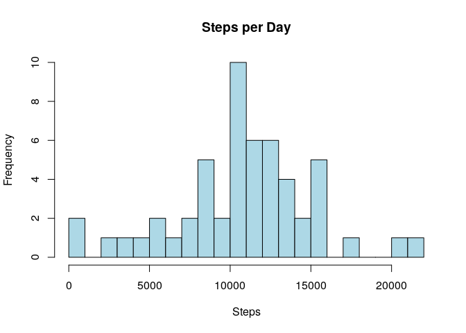
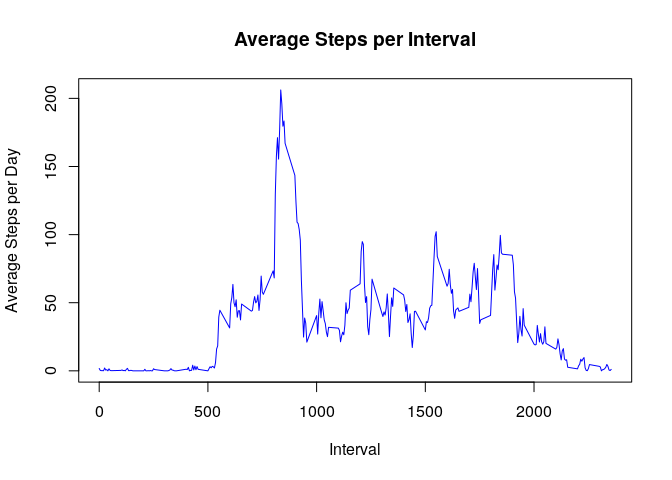
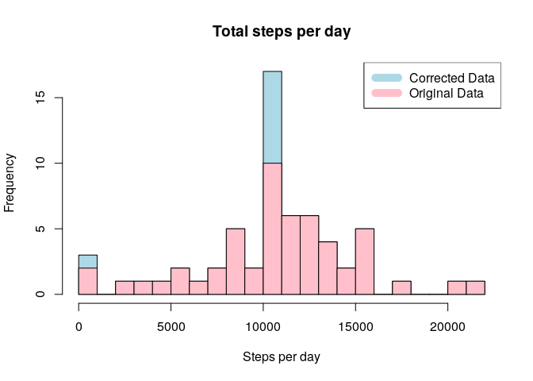
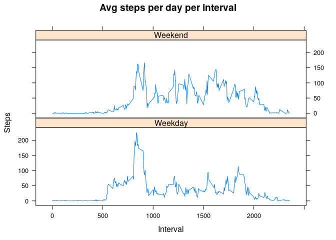

**Note:** Extra libraries used

```r
library(lattice)
```

## Loading and preprocessing the data

*The data available in the git repository, so not downloaded again.*

#### a. Unzip the data and read the csv file to a variable.

```r
unzip("activity.zip")

d <- read.csv("activity.csv")
```

## Histogram of Total steps per day

#### a. Total number of steps taken per day

```r
stepsPerDay <- aggregate(d$steps, by = list(d$date), FUN=sum)

head(stepsPerDay, n= 10)
```

```
##       Group.1     x
## 1  2012-10-01    NA
## 2  2012-10-02   126
## 3  2012-10-03 11352
## 4  2012-10-04 12116
## 5  2012-10-05 13294
## 6  2012-10-06 15420
## 7  2012-10-07 11015
## 8  2012-10-08    NA
## 9  2012-10-09 12811
## 10 2012-10-10  9900
```

#### b. Histogram of stepsPerDay

```r
hist(stepsPerDay$x, col="lightblue", breaks = 30, main="Steps per Day", xlab = "Steps", ylab = "Frequency")
```

<!-- -->

## What is mean total number of steps taken per day?

#### a. Mean and median of the total number of steps taken per day

```r
c(Mean = mean(stepsPerDay$x, na.rm = TRUE), Median = median(stepsPerDay$x, na.rm = TRUE))
```

```
##     Mean   Median 
## 10766.19 10765.00
```


## What is the average daily activity pattern?

#### a. Subset the steps based on interval

```r
stepsByInterval <- aggregate(steps ~ interval, data = d, FUN = mean, na.action = na.omit)
```

#### b. Time series plot of avg steps per day

```r
plot(x=stepsByInterval$interval, y=stepsByInterval$steps, type = 'l', xlab = "Interval", ylab = "Average Steps per Day", col="blue", main="Average Steps per Interval")
```

<!-- -->

#### c. 5 min interval having maximum steps on average

```r
stepsByInterval[which.max(stepsByInterval$steps),1]
```

```
## [1] 835
```


## Imputing missing values

#### a. Total no of missing values in steps column of the dataset

```r
sum(is.na(d$steps))
```

```
## [1] 2304
```

#### b. Stretegy for filling the missing values in the dataset
Missing step values are filled with average for each interval.

```r
new <- transform(d, steps = ifelse(is.na(d$steps), stepsByInterval$steps[match(d$interval, 
                                                    stepsByInterval$interval)], d$steps))

new[as.character(new$date) == "2012-10-01", 1] <- 0  # It will be 0, as no value is available
```

#### c. New dataset with the missing values filled in

```r
summary(new)
```

```
##      steps                date          interval     
##  Min.   :  0.00   2012-10-01:  288   Min.   :   0.0  
##  1st Qu.:  0.00   2012-10-02:  288   1st Qu.: 588.8  
##  Median :  0.00   2012-10-03:  288   Median :1177.5  
##  Mean   : 36.77   2012-10-04:  288   Mean   :1177.5  
##  3rd Qu.: 24.79   2012-10-05:  288   3rd Qu.:1766.2  
##  Max.   :806.00   2012-10-06:  288   Max.   :2355.0  
##                   (Other)   :15840
```

#### d. Histogram to show the difference between substituted dataset and new dataset


```r
new_stepsPerDay <- aggregate(steps ~ date, new, sum)

hist(new_stepsPerDay$steps, col = "lightblue", xlab = "Steps per day", main = paste("Total steps per day"), breaks = 30)

hist(stepsPerDay$x, col = "pink", xlab = "Steps per day", main = paste("Total steps per day"), add=T, breaks = 30)
legend("topright", c("Corrected Data", "Original Data"), col = c("lightblue", "pink"), lwd = 10)
```

<!-- -->

#### e. Mean and median of new data

```r
c(Mean = mean(new_stepsPerDay$steps), Median = median(new_stepsPerDay$steps))
```

```
##     Mean   Median 
## 10589.69 10766.19
```

Difference between the original and substituted dataset

| Dataset                         | Mean(Steps)   |  Median(steps)  |    
|---------------------------------|---------------|-----------------|
| Original Dataset(with NA)       | 10766.19      |   10765         |
| Substituted Dataset(without NA) | 10589.69      |   10766         |


## Are there differences in activity patterns between weekdays and weekends?

#### a. New factor variable in dataset with two levels - "weekday" and "weekend" indicating whether a given data is a weekday or weekend day.


```r
weekdays <- c("Monday", "Tuesday", "Wednesday", "Thursday", "Friday")
new$dayOfWeek <- as.factor(ifelse(is.element(weekdays(as.Date(new$date)), weekdays), "Weekday", "Weekend"))

head(new, n = 10)
```

```
##    steps       date interval dayOfWeek
## 1      0 2012-10-01        0   Weekday
## 2      0 2012-10-01        5   Weekday
## 3      0 2012-10-01       10   Weekday
## 4      0 2012-10-01       15   Weekday
## 5      0 2012-10-01       20   Weekday
## 6      0 2012-10-01       25   Weekday
## 7      0 2012-10-01       30   Weekday
## 8      0 2012-10-01       35   Weekday
## 9      0 2012-10-01       40   Weekday
## 10     0 2012-10-01       45   Weekday
```

#### b. Weekday and Weekend Plot 
A time series plot(type = 'l') of 5min interval(x-axis) and avg steps taken, avg across all weekdays or weekends (y-axis).

```r
new_stepByInterval <- aggregate(steps ~ interval+dayOfWeek, new, mean)

xyplot(new_stepByInterval$steps ~ new_stepByInterval$interval|new_stepByInterval$dayOfWeek, type='l', main="Avg steps per day per interval", xlab="Interval",ylab="Steps",layout=c(1,2))
```

<!-- -->
